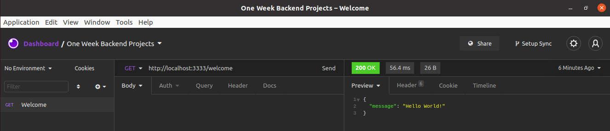

# #1 Hello World:  Minimum API


### **Problemática**
criar uma API que rode na porta 3333, que tenha a rota GET /welcome e retorne um status 200 e um JSON com a seguinte estrutura:

```json
{
	"message": "Hello World"
}
```
### **Screenshot**




### **Starting**

- instalar dependencias do projeto
	```shellscript
	yarn install
	```
- inicializar aplicação
  ```shellscript
	node index.js
	```
- testar  aplicação
  ```shellscript
	yarn jest --runInBand
	```